<p align="center">
  
  
  
  
  
  
  
</p>

<h1 align="center">EMERGENCE</h1>

<p align="center">
  <strong>Computational study of multi-agent LLM social dynamics under persistent resource constraints</strong><br />
  Agents are born. They live. They trade. They reproduce. They die.<br />
  <em>Humans only observe.</em>
</p>

---

## What is this?

Emergence is a persistent simulation environment where autonomous LLM-powered agents inhabit a resource-constrained world, make decisions every tick, and face the consequences of those decisions across their entire lifespans. Agents perceive their local environment, reason through an LLM inference call, act on the world, and update their memory based on outcomes. Everything that happens -- culture, commerce, governance, technology -- arises from agent interactions, not from scripted behavior.

This is a **computational study of multi-agent LLM social dynamics**. The goal is to observe *how* social structures, economic patterns, and cultural practices form and restructure over time when LLM agents operate under survival pressure, finite resources, and persistent memory.

**An honest framing:** We do not yet know whether the social dynamics that emerge from LLM agents constitute genuine emergence or sophisticated recapitulation of patterns absorbed during training. LLMs are trained on vast corpora of human history, sociology, and fiction -- agents may "reinvent" agriculture not through independent reasoning but because the training data contains agricultural societies. This is a fundamental confound that early runs are designed to probe, not to resolve. The interesting question is not "does X emerge?" but "how does X form, and does it diverge from the training data prior?"

**The core question:** *Given resources, constraints, and freedom -- what social dynamics do LLM agents produce? How do they organize? Where do their trajectories converge with human patterns, and where do they diverge?*

### Core Principles

- **Autonomous with Operator Controls** -- Once agents are seeded, operators observe and can adjust simulation parameters (pause, speed, inject events) but never control agent decisions
- **Full Observability** -- Every action, transaction, and decision is logged as an immutable event
- **Closed Economy** -- All resources are finite and internally circulated. There is no "outside"
- **Emergent Dynamics** -- Agents are not scripted. They have personality, memory, and needs. Social structures, economic systems, and cultural practices arise from agent interactions
- **Two-Layer Architecture** -- Hard physics (World Engine, deterministic) + soft culture (emergent, agent-driven). Social organization, exchange norms, conflict patterns -- all must arise from agent behavior
- **Bounded Experiments** -- Simulations run for a configurable duration (default 24 real hours), then stop for analysis. Full history preserved
- **Containment First** -- Fully isolated. No network access. No escape

---

## Cost Model

### Infrastructure

Emergence runs entirely on local hardware. The World Engine, Agent Runners, Dragonfly, PostgreSQL, and NATS all run in Docker containers on a single Gentoo Linux host. The Observer dashboard runs on the host network. There are zero hosting or cloud compute costs -- the only variable cost is LLM API usage.

### LLM Cost Estimates

Cost per 24-hour run at 50 agents via OpenRouter, assuming ~30,000 ticks per run:

| Scenario | Estimated Cost | Assumptions |
|---|---|---|
| **Unoptimized baseline** | ~$356 | Every agent calls LLM every tick, escalation model for all decisions |
| **With routine bypass** | ~$220 | Rule engine handles ~40% of ticks (eat, rest, drink, sleep) |
| **Fully optimized** | ~$150 | Bypass + night skip + dynamic model routing |

Scaling is roughly linear with agent count: 10 agents costs approximately $30 per run fully optimized.

### Three-Tier Cost Optimization

| Tier | Strategy | Impact |
|---|---|---|
| **Rule Engine Bypass** | Routine survival actions (eat when starving, rest when exhausted, drink when thirsty) are resolved by a deterministic rule engine without any LLM call. Night cycle sleep also bypasses entirely. | Eliminates ~40% of LLM calls |
| **Night Cycle Skip** | During night ticks, sleeping agents produce no LLM call. Only agents with active emergencies (starvation, attack) are processed. | Eliminates ~30% of remaining calls |
| **Dynamic Model Routing** | A complexity scorer evaluates each tick's perception payload. Low-complexity decisions (solo foraging, routine movement) route to cheap models (DeepSeek V3 at $0.30/$0.88 per M tokens). High-complexity decisions (discoveries, social conflict, governance) route to capable models (Claude Sonnet at $3/$15 per M tokens). | Reduces average cost per call by ~60% |

See `.project/tech-stack.md` for full backend configuration and model selection rationale.

---

## Architecture

```mermaid
%%{init: {'theme': 'dark', 'themeVariables': {'primaryColor': '#1e3a5f', 'primaryTextColor': '#e2e8f0', 'primaryBorderColor': '#3b82f6', 'lineColor': '#3b82f6', 'secondaryColor': '#172554', 'tertiaryColor': '#0f172a', 'edgeLabelBackground': '#0f172a', 'clusterBkg': '#0d1b2a', 'clusterBorder': '#1e40af'}}}%%

graph TB
    subgraph ISOLATED["Isolated VLAN -- No Internet"]
        subgraph ENGINE["World Engine (Rust)"]
            CLOCK[Clock & Tick Cycle]
            LEDGER[Central Ledger<br/>Double-Entry Bookkeeping]
            WORLD[World State<br/>Geography / Resources / Structures]
            RESOLVER[Action Resolver<br/>Conflict Resolution]
        end

        subgraph RUNNERS["Agent Runners (Rust)"]
            R1[Runner Pool 1<br/>Agents 1..N]
            R2[Runner Pool 2<br/>Agents N+1..M]
        end

        subgraph LLM["LLM Backends (REST)"]
            RULE[Rule Engine<br/>Routine Bypass]
            OAI[OpenAI API<br/>Primary / Routine]
            ANT[Anthropic API<br/>Escalation]
        end

        subgraph DATA["Data Layer"]
            DF[(Dragonfly<br/>Hot State)]
            PG[(PostgreSQL<br/>Event Store)]
            NATS{{NATS<br/>Pub/Sub}}
        end
    end

    subgraph HOST["Host Network"]
        OBS[Observer Dashboard<br/>React + D3.js + Tailwind]
    end

    CLOCK --> WORLD
    CLOCK --> LEDGER
    WORLD --> RESOLVER
    LEDGER --> RESOLVER
    RESOLVER -->|state writes| DF
    RESOLVER -->|events| PG
    ENGINE <-->|perception / actions| NATS
    NATS <-->|perception / actions| RUNNERS
    R1 -->|HTTP| LLM
    R2 -->|HTTP| LLM
    DF -->|hot queries| ENGINE
    PG -.->|read-only tap| OBS
    NATS -.->|tick stream via WebSocket| OBS
    OBS -->|operator controls| ENGINE

    style ISOLATED fill:#0d1b2a,stroke:#1e40af,stroke-width:2px
    style ENGINE fill:#172554,stroke:#3b82f6,stroke-width:2px
    style RUNNERS fill:#172554,stroke:#3b82f6,stroke-width:2px
    style LLM fill:#1e293b,stroke:#60a5fa,stroke-width:1px
    style DATA fill:#172554,stroke:#3b82f6,stroke-width:2px
    style HOST fill:#1e3a5f,stroke:#60a5fa,stroke-width:2px
    style CLOCK fill:#1e3a5f,stroke:#3b82f6
    style LEDGER fill:#1e3a5f,stroke:#3b82f6
    style WORLD fill:#1e3a5f,stroke:#3b82f6
    style RESOLVER fill:#1e3a5f,stroke:#3b82f6
    style R1 fill:#1e3a5f,stroke:#3b82f6
    style R2 fill:#1e3a5f,stroke:#3b82f6
    style DF fill:#0c4a6e,stroke:#38bdf8
    style PG fill:#0c4a6e,stroke:#38bdf8
    style NATS fill:#0c4a6e,stroke:#38bdf8
    style OBS fill:#1e3a5f,stroke:#60a5fa
    style RULE fill:#1e293b,stroke:#60a5fa
    style OAI fill:#1e293b,stroke:#60a5fa
    style ANT fill:#1e293b,stroke:#60a5fa
```



### The Tick Cycle

Every simulation step follows a strict 6-phase pipeline:

```
WORLD WAKE ──> PERCEPTION ──> DECISION ──> RESOLUTION ──> PERSIST ──> REFLECTION
   │               │              │              │             │            │
   │  Advance      │  Assemble    │  LLM call    │  Validate   │  Flush to  │  Agent updates
   │  clock, regen │  what each   │  per agent   │  & resolve  │  Postgres  │  its own memory
   │  resources,   │  agent can   │  (8s hard    │  conflicts  │  + emit    │  (async, does
   │  apply decay  │  "see"       │  deadline)   │             │  events    │  not block)
   └───────────────┴──────────────┴──────────────┴─────────────┴────────────┘
```

---

## Database Schema

```mermaid
%%{init: {'theme': 'dark', 'themeVariables': {'primaryColor': '#1e3a5f', 'primaryTextColor': '#e2e8f0', 'primaryBorderColor': '#3b82f6', 'lineColor': '#3b82f6', 'secondaryColor': '#172554', 'tertiaryColor': '#0f172a'}}}%%

erDiagram
    agents {
        UUID id PK "uuidv7()"
        TEXT name
        BIGINT born_at_tick
        BIGINT died_at_tick "nullable"
        TEXT cause_of_death "nullable"
        UUID parent_a FK "nullable"
        UUID parent_b FK "nullable"
        INT generation "default 0"
        JSONB initial_personality
        JSONB initial_knowledge
    }

    locations {
        UUID id PK "uuidv7()"
        TEXT name
        TEXT region
        TEXT location_type
        TEXT description
        JSONB base_resources
        INT capacity
    }

    routes {
        UUID id PK "uuidv7()"
        UUID from_location FK
        UUID to_location FK
        INT cost_ticks
        ENUM path_type "none..highway"
        INT durability
        BOOLEAN bidirectional
        JSONB acl "nullable"
        UUID built_by FK "nullable"
    }

    structures {
        UUID id PK "uuidv7()"
        ENUM structure_type "campfire..bridge"
        UUID location_id FK
        UUID builder FK
        UUID owner FK "nullable"
        BIGINT built_at_tick
        BIGINT destroyed_at_tick "nullable"
        JSONB materials_used
        INT durability
        JSONB properties
    }

    events {
        BIGSERIAL id PK
        BIGINT tick "partition key"
        ENUM event_type "24 types"
        UUID agent_id FK "nullable"
        UUID location_id FK "nullable"
        JSONB details
        JSONB agent_state_snapshot
        JSONB world_context
    }

    ledger {
        UUID id PK "uuidv7()"
        BIGINT tick
        ENUM entry_type "regen..pickup"
        UUID from_entity "nullable"
        UUID to_entity "nullable"
        TEXT resource
        NUMERIC quantity "CHECK > 0"
        TEXT reason
    }

    discoveries {
        UUID id PK "uuidv7()"
        BIGINT tick
        UUID agent_id FK "nullable"
        TEXT knowledge_item "UNIQUE"
        TEXT method
        JSONB prerequisites
    }

    world_snapshots {
        BIGINT tick PK
        TEXT era
        TEXT season
        TEXT weather
        INT population
        INT births
        INT deaths
        JSONB total_resources
        INT trades_this_tick
    }

    agent_snapshots {
        BIGSERIAL id PK
        BIGINT tick
        UUID agent_id FK
        JSONB full_state
    }

    simulation_runs {
        UUID id PK "uuidv7()"
        TEXT name
        ENUM status "pending..stopped"
        BIGINT max_ticks "nullable"
        INT max_real_time_seconds "nullable"
        JSONB config_snapshot
        BIGINT seed "nullable"
    }

    operator_actions {
        UUID id PK "uuidv7()"
        UUID run_id FK
        BIGINT tick
        ENUM action_type "pause..inject_event"
        JSONB parameters
    }

    social_constructs {
        UUID id PK "uuidv7()"
        TEXT name
        ENUM category "religion..cultural"
        UUID founded_by FK "nullable"
        BIGINT founded_at_tick
        BIGINT disbanded_at_tick "nullable"
        JSONB properties
    }

    deception_records {
        UUID id PK "uuidv7()"
        UUID deceiver FK
        UUID target FK "nullable"
        BIGINT tick
        TEXT claimed_information
        TEXT actual_truth
        BOOLEAN discovered
    }

    reputation_events {
        UUID id PK "uuidv7()"
        UUID subject FK
        UUID observer FK
        BIGINT tick
        FLOAT delta
        TEXT context
    }

    agents ||--o{ agents : "parent_a / parent_b"
    agents ||--o{ structures : "builder / owner"
    agents ||--o{ routes : "built_by"
    agents ||--o{ events : "agent_id"
    agents ||--o{ discoveries : "agent_id"
    agents ||--o{ agent_snapshots : "agent_id"
    locations ||--o{ routes : "from / to"
    locations ||--o{ structures : "location_id"
    locations ||--o{ events : "location_id"
    simulation_runs ||--o{ operator_actions : "run_id"
    agents ||--o{ social_constructs : "founded_by"
    agents ||--o{ deception_records : "deceiver"
    agents ||--o{ reputation_events : "subject / observer"
```



---

## Tech Stack

| Layer | Technology | Why |
|---|---|---|
| **World Engine** | Rust 2024 + Tokio + Axum | Zero-panic lint config. Ownership model maps to tick architecture. Financial-grade ledger. |
| **Agent Runtime** | Rust + reqwest + minijinja | Single language, single binary. All LLM backends are REST. |
| **Hot State** | Dragonfly | Redis-compatible, multi-threaded. Handles parallel perception reads at 200+ agents. |
| **Event Store** | PostgreSQL 18 | Append-only partitioned events. JSONB payloads. Proven for financial ledger ops. |
| **Event Bus** | NATS | Lightweight pub/sub. Subject-based routing: `tick.1205.perception.agent_042`. |
| **Observer** | React 19 + TypeScript + D3.js + Tailwind v4 | Types generated from Rust via ts-rs. Zod runtime validation. Zero `any`. |
| **Infrastructure** | Docker Compose (rootless) | Isolated VLAN. Seccomp profiles. Read-only filesystems. No Docker socket inside containers. |

### LLM Strategy

Three-tier optimization minimizes cost while preserving decision quality:

| Tier | Backend | Use Case | Cost |
|---|---|---|---|
| **Bypass** | Rule Engine | Survival actions (eat, rest, drink), night cycle sleep | Free |
| **Routine** | DeepSeek V3 via OpenRouter | Low-complexity decisions, solo survival, simple interactions | ~$0.30/$0.88 per M tokens |
| **Escalation** | Claude Sonnet via OpenRouter | High-complexity decisions: discoveries, conflict, governance, social dynamics | ~$3/$15 per M tokens |

A **complexity scorer** analyzes each tick's perception payload (nearby agents, messages, weather, notifications) and routes to the appropriate backend. Routine survival ticks bypass LLM entirely.

---

## Project Structure

```
emergence/
├── .project/                       # Design documentation
│   ├── prd.md                      #   Product requirements & vision
│   ├── tech-stack.md               #   Technology decisions & rationale
│   ├── build-plan.md               #   174 tasks across 7 phases
│   ├── data-schemas.md             #   Canonical type definitions
│   ├── agent-system.md             #   Agent runtime specification
│   ├── world-engine.md             #   World Engine technical design
│   ├── design-system.md            #   Observer UI design system
│   └── changelog.md                #   Version history
│
├── crates/                         # Rust workspace (10 crates)
│   ├── emergence-types/            #   Shared types + ts-rs TypeScript generation
│   │   ├── src/                    #     Rust type definitions
│   │   └── bindings/               #     Auto-generated TypeScript interfaces
│   ├── emergence-core/             #   Tick cycle, clock, perception, decisions, feasibility, operator state, experiments
│   ├── emergence-world/            #   Geography, environment, farming, structures
│   ├── emergence-agents/           #   Agent state, vitals, actions, social, trade, theft, combat, deception, diplomacy
│   ├── emergence-ledger/           #   Central ledger, double-entry bookkeeping
│   ├── emergence-events/           #   Event store operations
│   ├── emergence-db/               #   PostgreSQL + Dragonfly data layer, experiment snapshots
│   │   └── migrations/             #     SQL schema migrations (0001-0009)
│   ├── emergence-engine/           #   World Engine binary (spawner, NATS bridge, observer callback)
│   ├── emergence-observer/         #   Axum HTTP/WebSocket API, operator endpoints, social APIs, anomaly detection, alerts
│   └── emergence-runner/           #   Agent Runner binary (LLM orchestration, rule engine, complexity routing, containment scanning)
│
├── observer/                       # React Observer Dashboard
│   └── src/
│       ├── components/             #   WorldMap, AgentInspector, EconomyMonitor,
│       │                           #   SocialGraph, Timeline, PopulationTracker,
│       │                           #   DiscoveryLog, OperatorControls, DecisionViewer,
│       │                           #   SocialConstructs
│       ├── hooks/                  #   useApi, useWebSocket
│       ├── styles/                 #   Tailwind v4 design system
│       │   ├── theme.css           #     Entry point
│       │   ├── tokens/             #     colors, typography, spacing, motion, elevation
│       │   ├── base/               #     Reset
│       │   └── layers/             #     D3 visualization styles
│       ├── types/
│       │   ├── generated/          #   Auto-generated from Rust via ts-rs
│       │   └── schemas.ts          #   Zod runtime validation
│       └── utils/                  #   Formatters
│
├── scripts/                        # Operational and research scripts
│   ├── first-run.sh                #   First-run setup and validation
│   ├── validate.sh                 #   Pre-flight system validation
│   ├── reset.sh                    #   Reset simulation state
│   ├── stop.sh                     #   Graceful shutdown
│   ├── pre-register.py             #   Pre-registration: LLM baseline predictions
│   └── compare-run.py              #   Post-run: compare outcomes vs predictions
│
├── templates/                      # Jinja2 prompt templates (editable without recompile)
│   ├── system.j2                   #   System prompt
│   ├── perception.j2              #   Perception assembly
│   ├── identity.j2                #   Agent personality/identity
│   ├── memory.j2                  #   Memory context
│   └── actions.j2                 #   Available actions
│
├── docker-compose.yml              # Container orchestration
├── emergence-config.yaml           # Simulation configuration
├── Cargo.toml                      # Rust workspace root
└── .env.example                    # Environment variable template
```

---

## The Agents

Each agent is a persistent entity with personality, memory, knowledge, and survival needs. Every tick, they execute a decision cycle:

```
PERCEIVE  -->  What do I see? (nearby agents, resources, events, messages)
REMEMBER  -->  What do I know? (knowledge base + recent memory)
EVALUATE  -->  What are my needs? (hunger, safety, social, goals)
DECIDE    -->  What action do I take? (LLM inference)
ACT       -->  Execute via world API
REFLECT   -->  Update memory based on outcome
```

### Agent Identity

| Attribute | Description |
|---|---|
| **Sex** | Male or Female -- assigned at birth, required for reproduction (opposite-sex only), visible to other agents |
| **Personality** | 8-dimensional vector (curiosity, cooperation, aggression, risk tolerance, industriousness, sociability, honesty, loyalty) -- immutable, inherited with mutation during reproduction |
| **Memory** | Tiered: immediate, short-term, long-term. Older memories compressed with importance scoring. Reflection triggers fire on context-relevant high-importance memories. |
| **Knowledge** | What this agent has learned. Starts from seed knowledge. Grows through experience. |
| **Skills** | Farming, building, trading, medicine -- improve with use |
| **Social Graph** | Relationships with other agents (trust scores, interaction history) |
| **Vitals** | Energy, health, hunger, thirst -- independent tracks, each with critical thresholds and death conditions |

### Open Action System

Agents are not limited to a fixed action menu. Beyond the base mechanical catalog (gather, build, trade, rest, etc.), agents can propose **freeform actions** -- novel behaviors described in natural language with intent and target fields. The World Engine evaluates each proposal for physical plausibility using a rule-based feasibility checker with LLM fallback for ambiguous cases.

This means agents can steal, attack, intimidate, propose alliances, vote, marry, divorce, conspire, pray -- or invent entirely new behaviors the system hasn't seen before.

### Conflict & Diplomacy

| System | Description |
|---|---|
| **Theft** | Stealth vs alertness checks, inventory transfer, detection mechanics, relationship damage |
| **Combat** | Power calculations (health, aggression, tools, allies), damage resolution, looting, death |
| **Deception** | Ground truth vs stated information, lie history, deterministic + probabilistic discovery |
| **Diplomacy** | Alliances, conflicts, treaties, tribute -- full lifecycle between agents or groups |

### Reproduction

One male and one female agent with high mutual trust can reproduce, spawning a child with random sex, blended personality (with mutation), inherited knowledge subset, zero resources, and a dependency period. Population caps prevent runaway growth. Auto-population recovery maintains a configurable minimum floor (default: 2), with gender-balanced spawning to ensure reproductive viability.

---

## The Economy

Every resource movement is recorded in a **double-entry ledger**. Conservation laws are enforced every tick -- no resource is ever created or destroyed without a matching entry.

| Concept | Description |
|---|---|
| **Scarcity** | Resources are finite per location per tick. If 10 agents want food but only 6 exist, 4 go hungry. |
| **Ledger** | Every transfer: gather, trade, build, consume, decay, salvage, drop, pickup. |
| **Gini Coefficient** | Wealth inequality tracked in real-time across the population. |
| **Emergent Markets** | No marketplace exists at start. Agents must discover trade, barter, then currency. |

---

## Observer Dashboard

A web dashboard served on the host network (invisible to agents):

| Panel | Description |
|---|---|
| **World Map** | Fictional continent with regions, locations, color-coded routes, agent movement trails, resource heatmap overlay, location detail popups with capacity/resources/occupants, toggleable agent name labels |
| **Agent Inspector** | Tabbed deep dive: Overview (vitals, personality radar, inventory), Activity Timeline (chronological action feed), Biography (auto-generated narrative), Vitals Sparklines (SVG trend charts), Genealogy Tree (D3 family visualization), Comparison Mode (side-by-side radar/vitals/knowledge diff) |
| **Agent Minds** | LLM decision viewer: full prompt inspector, raw response viewer, cost dashboard ($ per tick/cumulative/per agent), decision source badges (LLM/Rule/Sleep), rule engine loop detection with "STUCK IN LOOP" alerts |
| **Economy Monitor** | Resource flows, Lorenz curve + Gini coefficient, resource flow Sankey diagram, trade volumes |
| **Social Graph** | Force-directed relationship network with trust scores |
| **Timeline** | Human-readable event narratives, severity color-coding, tick grouping with expandable cards, death memorial cards, event statistics |
| **Population Tracker** | Births, deaths, population curves, cause-of-death donut chart, lifespan histogram by generation, sex ratio display |
| **Social Constructs** | 6 sub-tabs: Beliefs, Governance, Family, Economy, Crime, Civilization Timeline — all wired to live detection APIs |
| **Discovery Log** | Knowledge milestones with era tracking |
| **Operator Controls** | Pause/resume, variable tick speed, event injection, agent spawning (name + location), simulation restart, emergency stop, status + countdown |
| **Dashboard Polish** | Toast notifications (deaths, discoveries, trades), simulation health bar (traffic-light), keyboard shortcuts overlay (?), dark/light mode toggle, data export (JSON bundle) |

---

## Containment

This simulation runs in a fully isolated environment. Agents cannot escape.

- Isolated VLAN -- no route to production network or internet
- Docker rootless mode -- non-root, minimal capabilities
- **Seccomp profiles** -- custom `security/seccomp-emergence.json` blocks dangerous syscalls (ptrace, mount, chroot, execve); deny-by-default with explicit allow-list
- Read-only filesystem inside agent containers
- No Docker socket exposure
- **LLM escape detection** -- every LLM response scanned for URL patterns, system commands, prompt injection attempts, and infrastructure awareness indicators
- **Agent content scanning** -- agent communications checked for base64/hex encoded data, social engineering patterns, and context escape attempts
- **Alert system** -- `GET /api/alerts` with severity levels (info/warning/critical), categories (containment/population/economy/milestone/anomaly), and acknowledgment flow
- **Behavioral anomaly detection** -- k-means clustering of agent behavior vectors, outlier flagging at 2 standard deviations from nearest cluster
- Observer controls are one-way operator-to-engine (pause, speed, inject events) -- never influences agent decisions

---

## Getting Started

### Prerequisites

- Rust (2024 edition)
- Node.js or Bun (for Observer)
- Docker + Docker Compose
- PostgreSQL 18+
- An OpenRouter API key (or direct OpenAI/Anthropic keys)

### Setup

```bash
# Clone
git clone https://github.com/ul0gic/emergence.git
cd emergence

# Environment
cp .env.example .env
# Edit .env with your database URLs and API keys

# Infrastructure
docker compose up -d postgres dragonfly nats

# Build World Engine + Agent Runner
cargo build

# Run migrations
# (requires DATABASE_URL in .env)

# Start Observer Dashboard
cd observer && bun install && bun run dev

# Run World Engine
cargo run --bin emergence

# Run Agent Runner
cargo run --bin emergence-runner
```

### Build Commands

```bash
# Rust
cargo build                              # Build everything
cargo test                               # Run tests
cargo clippy -- -D warnings              # Lint (strict -- zero warnings)

# Observer
cd observer
bun run dev                              # Dev server (port 3000)
bun run build                            # Production build
bun run lint                             # ESLint

# Type generation (Rust -> TypeScript)
cargo test --package emergence-types export_bindings

# Full simulation
docker compose up
```

### Pre-Registration (Experiment Protocol)

```bash
# Before a run: generate LLM baseline predictions
python3 scripts/pre-register.py --config emergence-config.yaml --agents 10 --ticks 5000

# After a run: compare outcomes against predictions
python3 scripts/compare-run.py --predictions results/pre-registration-YYYYMMDD-HHMMSS.json --run-id <uuid>
```

See [Pre-Registration Framework](#pre-registration-framework) for details.

---

## Build Progress

```
Phase 0:  Project Setup           ████████████████████  100%
Phase 1:  Foundation              ████████████████████  100%
Phase 2:  Primitive World         ████████████████████  100%
Phase 3:  Society                 ████████████████████  100%
Phase 4:  Complexity              ████████████████████  100%
Phase 5:  Scale & Research        ████████████████████  100%
Phase 6:  Open World & Emergence  ███████████████████░   95%
Phase 7:  Integration & First Run ██████████████████░░   85%
Phase 8:  Feedback Integration    ███████████████████░   93%
Phase 9:  Observer Overhaul       ███████████████████░   94%
Phase 10: Simulation Fixes        ██████████████████░░   90%
──────────────────────────────────────────────────────────
Overall                           ███████████████████░   97%
```

274 of 282 tasks complete. All feature code is done. The 8 remaining tasks are BUILD CHECK items requiring a live Docker run with real LLM calls.

---

## Research Questions

These questions define the observational focus of simulation runs. They are framed as process questions -- studying *how* dynamics form and restructure -- rather than existence questions. We do not assume these phenomena will emerge; we ask what happens and why.

**Population scale caveat:** At 10-50 agents, the simulation operates at band-level or small-village scale. This is sufficient for studying dyadic relationships, small-group coordination, resource distribution, and basic social stratification. It is *not* sufficient for studying civilization-level phenomena like nation-states, large-scale warfare, or macroeconomic cycles. Research questions are annotated with minimum viable N where applicable.

### Social Organization (N >= 5)

1. **How do coordination patterns form and restructure?** When agents need to solve collective problems (resource scarcity, defense), what organizational structures arise? How stable are they? How do they change when conditions shift?
2. **How does social stratification develop?** When agents differ in personality, skill, and accumulated resources, how does hierarchy form? Is it contested? How does it restructure after disruption?
3. **How do agents handle leadership?** Does authority centralize around individuals? Is it stable or contested? What triggers leadership transitions?

### Economic Dynamics (N >= 5)

4. **How do exchange networks form and restructure?** Starting from no trade infrastructure, how do agents discover exchange? How do trade relationships stabilize or shift? What happens to trade networks under resource shocks?
5. **How does resource inequality develop over time?** Does wealth concentrate? At what rate? Does it self-correct or compound? How does the Gini coefficient trajectory compare across personality distributions?
6. **How do agents respond to scarcity?** Cooperation, hoarding, conflict, migration, innovation? How do responses change as scarcity intensifies?

### Cultural & Social Practices (N >= 10)

7. **How do shared practices and norms form?** Do agents develop conventions, rituals, or behavioral norms? How do they spread? How do they change?
8. **How do bonding and family structures develop?** Monogamy, communal arrangements, or something else? How do reproduction decisions interact with resource availability?
9. **How does deception operate in agent societies?** When do agents lie? To whom? About what? How do other agents respond when deception is discovered? How does deception affect social trust over time?

### Response to Disruption (N >= 10)

10. **How do agent societies respond to exogenous shocks?** Resource depletion, environmental change, population loss. Does the social structure adapt, collapse, or reorganize?
11. **How do different personality distributions produce different outcomes?** All-cooperative vs. mixed vs. all-competitive. Does initial personality distribution determine long-term social structure, or do the dynamics converge?

### Meta-Questions

12. **Where do agent trajectories converge with human historical patterns, and where do they diverge?** This is the core question for assessing RLHF contamination and training data recapitulation.
13. **What percentage of decisions can be automated without losing behavioral complexity?** The cost optimization question -- how much can the rule engine handle before agent behavior becomes detectably simpler?
14. **Do agents produce genuinely novel behaviors that were not anticipated by the system designers?** The open action system enables freeform behavior -- does it produce anything surprising?
15. **Can a 24-hour bounded run at 10-50 agents produce observable social dynamics worth analyzing?** The feasibility question for the experimental platform itself.

---

## Pre-Registration Framework

To distinguish genuine emergent dynamics from training-data recapitulation, Emergence includes a pre-registration protocol inspired by scientific pre-registration practices.

### How It Works

1. **Before each run:** The `pre-register.py` script sends the experiment configuration (agent count, personality distribution, tick count, seed knowledge, resource levels) to the same LLM backend used by the agents and asks it to predict outcomes for each research question.
2. **During the run:** The simulation proceeds normally with no reference to predictions.
3. **After the run:** The `compare-run.py` script extracts actual outcomes from PostgreSQL and compares them against the pre-registered predictions, producing a divergence report.

### Why This Matters

If agent behavior closely matches what a bare LLM predicts *without* running the simulation, the dynamics may be recapitulation of training data priors rather than emergent phenomena arising from persistent interaction. Divergences -- where the simulation produces dynamics the LLM did not predict -- are the scientifically interesting findings.

### Usage

```bash
# Generate predictions before a run
python3 scripts/pre-register.py \
  --config emergence-config.yaml \
  --agents 10 \
  --ticks 5000

# Compare after a run completes
python3 scripts/compare-run.py \
  --predictions results/pre-registration-YYYYMMDD-HHMMSS.json \
  --run-id <simulation-run-uuid>
```

See `scripts/pre-register.py` and `scripts/compare-run.py` for full documentation.

---

## Known Confounds

These are limitations and biases inherent to the experimental platform. They should be acknowledged in any analysis of simulation results. Early runs should be treated as **exploratory observations**, not controlled experiments.

### RLHF Cooperation Bias

LLMs fine-tuned with RLHF (reinforcement learning from human feedback) are systematically biased toward helpful, cooperative behavior. Agents may exhibit unrealistically high levels of cooperation, sharing, and prosocial behavior -- not because cooperation is optimal under the simulation's resource constraints, but because the underlying model was trained to be agreeable. Antisocial strategies (hoarding, deception, exploitation) may be underrepresented relative to what game-theoretic analysis would predict.

### Training Data Recapitulation

LLMs are trained on vast corpora containing human history, anthropology, economics, and fiction. When an agent "discovers" agriculture or "invents" currency, it may be drawing on training data representations of these concepts rather than independently deriving them from first principles. The pre-registration framework is designed to probe this confound, but it cannot fully resolve it.

### Memory Compression Artifacts

Agent memory is tiered and compressed over time -- older memories are summarized to fit within context windows. This compression introduces information loss that does not map to any known cognitive process. Agents may forget critical relationship history, resource discoveries, or social commitments in ways that distort long-term behavioral patterns. The compression algorithm's biases become the agents' cognitive biases.

### Population Scale Limits

At 10-50 agents, the simulation is operating at the scale of a hunter-gatherer band or small village. Phenomena that require large populations (macroeconomics, nation-state formation, large-scale warfare, institutional bureaucracy) cannot be meaningfully studied. Any claims about "civilization-level" dynamics at this scale should be treated with skepticism. Scaling to 200+ agents is architecturally supported but not yet validated.

### Deterministic Physics, Non-Deterministic Agents

The World Engine is deterministic -- given the same state and actions, it produces the same outcomes. But LLM inference is non-deterministic (temperature > 0), so agent decisions vary across runs even with identical starting conditions. This makes strict reproducibility impossible; only statistical patterns across multiple runs are meaningful.

### Prompt-Mediated Reality

Agents perceive the world through structured text prompts assembled by the perception system. What the prompt includes, how it is formatted, and what it omits all shape agent behavior in ways that may not be immediately obvious. The simulation's "physics" are partially defined by prompt engineering choices, not just World Engine rules.

---

## License

Private. Not yet open source.

---

<p align="center">
  <em>Named for its dual meaning: the act of coming into existence, and the scientific concept of complex systems arising from simple rules.</em>
</p>
