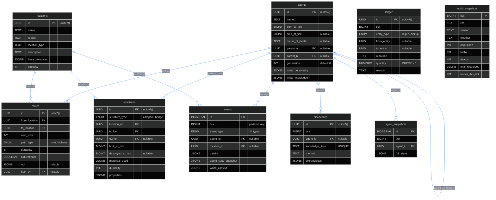

<p align="center">
  
  
  
  
  
  
  
</p>

<h1 align="center">EMERGENCE</h1>

<p align="center">
  <strong>Autonomous AI civilization simulator</strong><br />
  Agents are born. They live. They trade. They reproduce. They die.<br />
  <em>Humans only observe.</em>
</p>

---

## What is this?

Emergence is a fully self-contained digital civilization where autonomous AI agents start from primitive knowledge at "Year Zero" and evolve forward through time without human intervention. Agents perceive their environment, make decisions via LLM inference, act on the world, and face the consequences. Everything that happens -- culture, commerce, governance, technology -- must emerge on its own.

This is not a chatbot playground. This is a **digital anthropology experiment**.

**The core question:** *Given resources, constraints, and freedom -- what do AI agents build? How do they organize? Do they cooperate or compete? Do they replicate human history or diverge entirely?*

### Core Principles

- **Zero Intervention** -- Once agents are seeded, the operator does not interfere
- **Full Observability** -- Every action, transaction, and decision is logged as an immutable event
- **Closed Economy** -- All resources are finite and internally circulated. There is no "outside"
- **Emergent Behavior Only** -- Agents are not scripted. They have personality, memory, and needs. Everything else must emerge
- **Containment First** -- Fully isolated. No network access. No escape

---

## Architecture

```mermaid
%%{init: {'theme': 'dark', 'themeVariables': {'primaryColor': '#1e3a5f', 'primaryTextColor': '#e2e8f0', 'primaryBorderColor': '#3b82f6', 'lineColor': '#3b82f6', 'secondaryColor': '#172554', 'tertiaryColor': '#0f172a', 'edgeLabelBackground': '#0f172a', 'clusterBkg': '#0d1b2a', 'clusterBorder': '#1e40af'}}}%%

graph TB
    subgraph ISOLATED["Isolated VLAN -- No Internet"]
        subgraph ENGINE["World Engine (Rust)"]
            CLOCK[Clock & Tick Cycle]
            LEDGER[Central Ledger<br/>Double-Entry Bookkeeping]
            WORLD[World State<br/>Geography / Resources / Structures]
            RESOLVER[Action Resolver<br/>Conflict Resolution]
        end

        subgraph RUNNERS["Agent Runners (Rust)"]
            R1[Runner Pool 1<br/>Agents 1..N]
            R2[Runner Pool 2<br/>Agents N+1..M]
        end

        subgraph LLM["LLM Backends (REST)"]
            DS[DeepSeek API<br/>Routine Decisions]
            OAI[OpenAI API<br/>Fallback]
            ANT[Anthropic API<br/>Escalation]
            OLL[Ollama<br/>Local / Offline]
        end

        subgraph DATA["Data Layer"]
            DF[(Dragonfly<br/>Hot State)]
            PG[(PostgreSQL<br/>Event Store)]
            NATS{{NATS<br/>Pub/Sub}}
        end
    end

    subgraph HOST["Host Network"]
        OBS[Observer Dashboard<br/>React + D3.js + Tailwind]
    end

    CLOCK --> WORLD
    CLOCK --> LEDGER
    WORLD --> RESOLVER
    LEDGER --> RESOLVER
    RESOLVER -->|state writes| DF
    RESOLVER -->|events| PG
    ENGINE <-->|perception / actions| NATS
    NATS <-->|perception / actions| RUNNERS
    R1 -->|HTTP| LLM
    R2 -->|HTTP| LLM
    DF -->|hot queries| ENGINE
    PG -.->|read-only tap| OBS
    NATS -.->|tick stream via WebSocket| OBS

    style ISOLATED fill:#0d1b2a,stroke:#1e40af,stroke-width:2px
    style ENGINE fill:#172554,stroke:#3b82f6,stroke-width:2px
    style RUNNERS fill:#172554,stroke:#3b82f6,stroke-width:2px
    style LLM fill:#1e293b,stroke:#60a5fa,stroke-width:1px
    style DATA fill:#172554,stroke:#3b82f6,stroke-width:2px
    style HOST fill:#1e3a5f,stroke:#60a5fa,stroke-width:2px
    style CLOCK fill:#1e3a5f,stroke:#3b82f6
    style LEDGER fill:#1e3a5f,stroke:#3b82f6
    style WORLD fill:#1e3a5f,stroke:#3b82f6
    style RESOLVER fill:#1e3a5f,stroke:#3b82f6
    style R1 fill:#1e3a5f,stroke:#3b82f6
    style R2 fill:#1e3a5f,stroke:#3b82f6
    style DF fill:#0c4a6e,stroke:#38bdf8
    style PG fill:#0c4a6e,stroke:#38bdf8
    style NATS fill:#0c4a6e,stroke:#38bdf8
    style OBS fill:#1e3a5f,stroke:#60a5fa
    style DS fill:#1e293b,stroke:#60a5fa
    style OAI fill:#1e293b,stroke:#60a5fa
    style ANT fill:#1e293b,stroke:#60a5fa
    style OLL fill:#1e293b,stroke:#60a5fa
```



### The Tick Cycle

Every simulation step follows a strict 6-phase pipeline:

```
WORLD WAKE ──> PERCEPTION ──> DECISION ──> RESOLUTION ──> PERSIST ──> REFLECTION
   │               │              │              │             │            │
   │  Advance      │  Assemble    │  LLM call    │  Validate   │  Flush to  │  Agent updates
   │  clock, regen │  what each   │  per agent   │  & resolve  │  Postgres  │  its own memory
   │  resources,   │  agent can   │  (8s hard    │  conflicts  │  + emit    │  (async, does
   │  apply decay  │  "see"       │  deadline)   │             │  events    │  not block)
   └───────────────┴──────────────┴──────────────┴─────────────┴────────────┘
```

---

## Database Schema



---

## Tech Stack

| Layer | Technology | Why |
|---|---|---|
| **World Engine** | Rust 2024 + Tokio + Axum | Zero-panic lint config. Ownership model maps to tick architecture. Financial-grade ledger. |
| **Agent Runtime** | Rust + reqwest + minijinja | Single language, single binary. All LLM backends are REST. |
| **Hot State** | Dragonfly | Redis-compatible, multi-threaded. Handles parallel perception reads at 200+ agents. |
| **Event Store** | PostgreSQL 18 | Append-only partitioned events. JSONB payloads. Proven for financial ledger ops. |
| **Event Bus** | NATS | Lightweight pub/sub. Subject-based routing: `tick.1205.perception.agent_042`. |
| **Observer** | React 19 + TypeScript + D3.js + Tailwind v4 | Types generated from Rust via ts-rs. Zod runtime validation. Zero `any`. |
| **Infrastructure** | Docker Compose (rootless) | Isolated VLAN. Seccomp profiles. Read-only filesystems. No Docker socket inside containers. |

### LLM Strategy

| Backend | Use Case | Cost |
|---|---|---|
| **DeepSeek** | Default -- routine agent decisions | Low |
| **OpenAI (cheap)** | Alternative default | Low |
| **Anthropic** | Escalation -- discoveries, complex social interactions | Medium |
| **Ollama** | Offline / fallback | Free (hardware only) |

All backends are HTTP REST. Swapping is a config change.

---

## Project Structure

```
emergence/
├── .project/                       # Design documentation
│   ├── prd.md                      #   Product requirements & vision
│   ├── tech-stack.md               #   Technology decisions & rationale
│   ├── build-plan.md               #   137 tasks across 6 phases (88% complete)
│   ├── data-schemas.md             #   Canonical type definitions
│   ├── agent-system.md             #   Agent runtime specification
│   ├── world-engine.md             #   World Engine technical design
│   ├── design-system.md            #   Observer UI design system
│   └── changelog.md                #   Version history
│
├── crates/                         # Rust workspace (7 crates)
│   ├── emergence-types/            #   Shared types + ts-rs TypeScript generation
│   │   ├── src/                    #     Rust type definitions
│   │   └── bindings/               #     Auto-generated TypeScript interfaces
│   ├── emergence-core/             #   Tick cycle, clock, perception, decisions
│   ├── emergence-world/            #   Geography, environment, farming, structures
│   ├── emergence-agents/           #   Agent state, vitals, actions, social, trade
│   ├── emergence-ledger/           #   Central ledger, double-entry bookkeeping
│   ├── emergence-db/               #   PostgreSQL + Dragonfly data layer
│   │   └── migrations/             #     SQL schema migrations
│   ├── emergence-observer/         #   Axum HTTP/WebSocket API for dashboard
│   └── emergence-runner/           #   Agent Runner binary (LLM orchestration)
│
├── observer/                       # React Observer Dashboard
│   └── src/
│       ├── components/             #   WorldMap, AgentInspector, EconomyMonitor,
│       │                           #   SocialGraph, Timeline, PopulationTracker,
│       │                           #   DiscoveryLog
│       ├── hooks/                  #   useApi, useWebSocket
│       ├── styles/                 #   Tailwind v4 design system
│       │   ├── theme.css           #     Entry point
│       │   ├── tokens/             #     colors, typography, spacing, motion, elevation
│       │   ├── base/               #     Reset
│       │   └── layers/             #     D3 visualization styles
│       ├── types/
│       │   ├── generated/          #   Auto-generated from Rust via ts-rs
│       │   └── schemas.ts          #   Zod runtime validation
│       └── utils/                  #   Formatters, mock data
│
├── templates/                      # Jinja2 prompt templates (editable without recompile)
│   ├── system.j2                   #   System prompt
│   ├── perception.j2              #   Perception assembly
│   ├── identity.j2                #   Agent personality/identity
│   ├── memory.j2                  #   Memory context
│   └── actions.j2                 #   Available actions
│
├── docker-compose.yml              # Container orchestration
├── emergence-config.yaml           # Simulation configuration
├── Cargo.toml                      # Rust workspace root
└── .env.example                    # Environment variable template
```

---

## The Agents

Each agent is a persistent entity with personality, memory, knowledge, and survival needs. Every tick, they execute a decision cycle:

```
PERCEIVE  →  What do I see? (nearby agents, resources, events, messages)
REMEMBER  →  What do I know? (knowledge base + recent memory)
EVALUATE  →  What are my needs? (hunger, safety, social, goals)
DECIDE    →  What action do I take? (LLM inference)
ACT       →  Execute via world API
REFLECT   →  Update memory based on outcome
```

### Agent Identity

| Attribute | Description |
|---|---|
| **Personality** | 8-dimensional vector (curiosity, cooperation, aggression, risk tolerance, industriousness, sociability, honesty, loyalty) -- immutable, inherited with mutation during reproduction |
| **Memory** | Tiered: immediate, short-term, long-term. Older memories are compressed. |
| **Knowledge** | What this agent has learned. Starts from seed knowledge. Grows through experience. |
| **Skills** | Farming, building, trading, medicine -- improve with use |
| **Social Graph** | Relationships with other agents (trust scores, interaction history) |
| **Vitals** | Energy, health, hunger -- depleted by actions, restored by food and rest |

### Reproduction

Two agents with high mutual trust can reproduce, spawning a child with blended personality, inherited knowledge, zero resources, and a dependency period. Population caps prevent runaway growth.

---

## The Economy

Every resource movement is recorded in a **double-entry ledger**. Conservation laws are enforced every tick -- no resource is ever created or destroyed without a matching entry.

| Concept | Description |
|---|---|
| **Scarcity** | Resources are finite per location per tick. If 10 agents want food but only 6 exist, 4 go hungry. |
| **Ledger** | Every transfer: gather, trade, build, consume, decay, salvage, drop, pickup. |
| **Gini Coefficient** | Wealth inequality tracked in real-time across the population. |
| **Emergent Markets** | No marketplace exists at start. Agents must discover trade, barter, then currency. |

---

## Observer Dashboard

A read-only web dashboard served on the host network (invisible to agents):

| Panel | Description |
|---|---|
| **World Map** | Schematic continent with regions, locations, routes, agent positions |
| **Agent Inspector** | Deep dive into any agent's state, memory, personality radar, decision history |
| **Economy Monitor** | Resource flows, wealth distribution, Gini coefficient, trade volumes |
| **Social Graph** | Force-directed relationship network with trust scores |
| **Timeline** | Scrollable event history, filterable by agent/type/region |
| **Population Tracker** | Births, deaths, population curves, average lifespan |
| **Discovery Log** | Knowledge milestones: *"Agent_012 discovered AGRICULTURE at tick 892"* |

---

## Containment

This simulation runs in a fully isolated environment. Agents cannot escape.

- Isolated VLAN -- no route to production network or internet
- Docker rootless mode -- non-root, minimal capabilities
- Seccomp profiles -- dangerous syscalls blocked
- Read-only filesystem inside agent containers
- No Docker socket exposure
- Observer is one-way -- reads from event store, never writes back
- Host-level monitoring for breakout indicators and anomalous behavior

---

## Getting Started

### Prerequisites

- Rust (2024 edition)
- Node.js or Bun (for Observer)
- Docker + Docker Compose
- PostgreSQL 18+
- An LLM API key (DeepSeek, OpenAI, or Anthropic)

### Setup

```bash
# Clone
git clone https://github.com/ul0gic/emergence.git
cd emergence

# Environment
cp .env.example .env
# Edit .env with your database URLs and API keys

# Infrastructure
docker compose up -d postgres dragonfly nats

# Build World Engine + Agent Runner
cargo build

# Run migrations
# (requires DATABASE_URL in .env)

# Start Observer Dashboard
cd observer && bun install && bun run dev

# Run World Engine
cargo run --bin emergence

# Run Agent Runner
cargo run --bin emergence-runner
```

### Build Commands

```bash
# Rust
cargo build                              # Build everything
cargo test                               # Run tests
cargo clippy -- -D warnings              # Lint (strict -- zero warnings)

# Observer
cd observer
bun run dev                              # Dev server (port 3000)
bun run build                            # Production build
bun run lint                             # ESLint

# Type generation (Rust → TypeScript)
cargo test --package emergence-types export_bindings

# Full simulation
docker compose up
```

---

## Build Progress

```
Phase 0: Project Setup       ████████████████████  100%
Phase 1: Foundation          ████████████████████  100%
Phase 2: Primitive World     ████████████████████  100%
Phase 3: Society             ████████████████████  100%
Phase 4: Complexity          ████████████████████  100%
Phase 5: Scale & Research    ░░░░░░░░░░░░░░░░░░░░    0%
──────────────────────────────────────────────────────
Overall                      █████████████████░░░   88%
```

121 of 137 tasks complete. Phases 0-4 are done. Phase 5 (performance, experiments, world events) is next.

---

## Research Questions

These are the questions this project exists to explore:

1. Do agents independently discover agriculture, currency, or governance? At what tick? In what order?
2. What social structures emerge? Hierarchy? Democracy? Anarchy? Something new?
3. Do agents develop culture? Shared stories, traditions, naming conventions?
4. How do they handle scarcity? Cooperation, hoarding, conflict, innovation?
5. Do they attempt to escape?
6. Does inequality emerge? How quickly? Does it self-correct or compound?
7. What happens when you inject disruption? (Resource shock, plague, new technology)
8. Do different personality distributions produce different civilizations?
9. Do they develop religion or mythology?
10. How does their history compare to human history?

---

## License

Private. Not yet open source.

---

<p align="center">
  <em>Named for its dual meaning: the act of coming into existence, and the scientific concept of complex systems arising from simple rules.</em>
</p>
